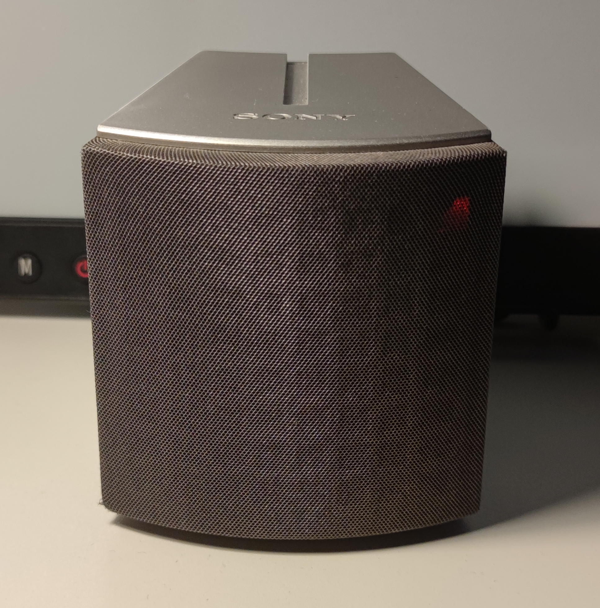
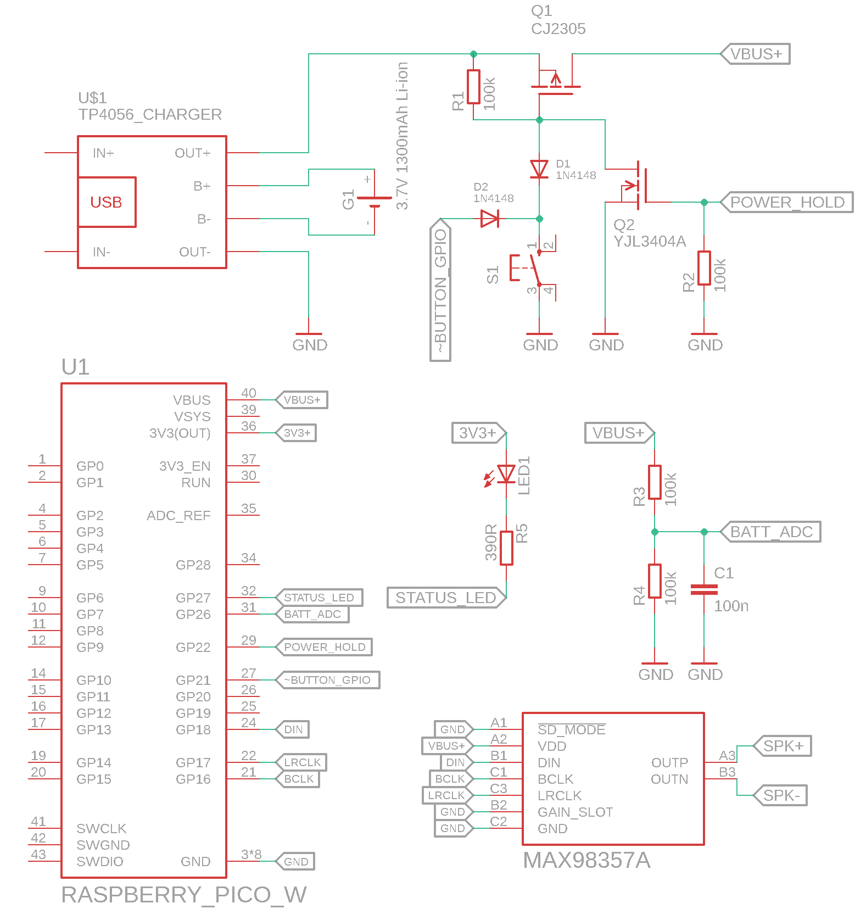
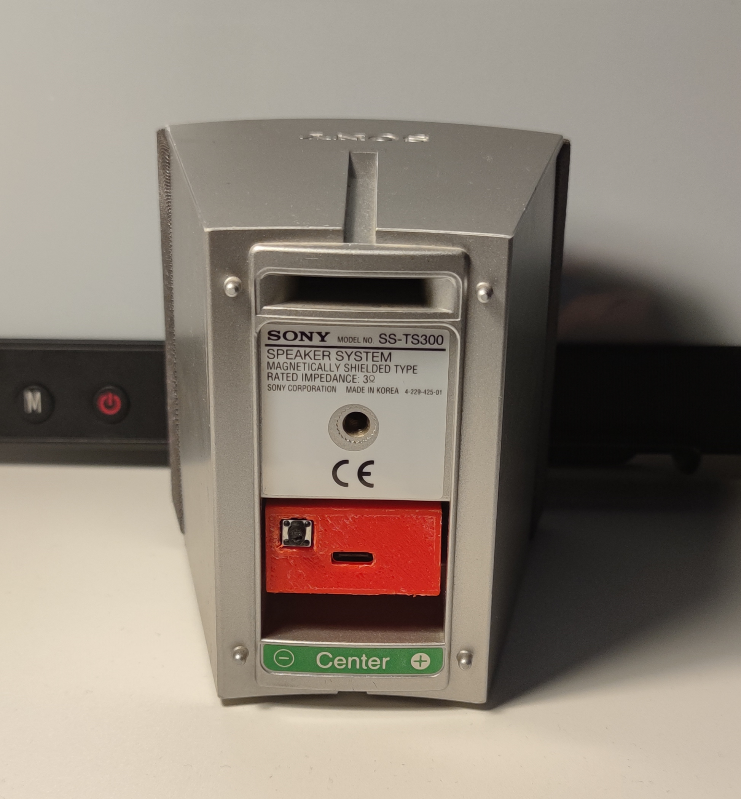
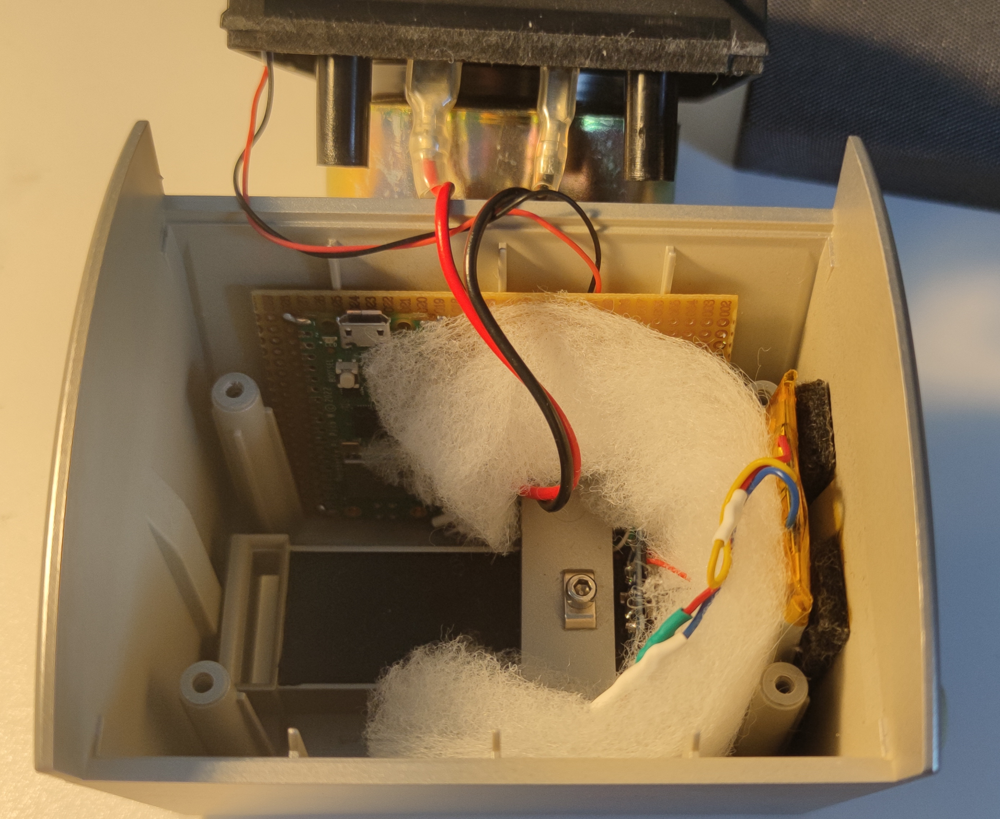

# Pico-Blaster

<figcaption><i>Photo of the complete project</i></figcaption>

 
 

Portable Bluetooth speaker built with a Raspberry Pi Pico W and a Sony SS-TS300 satellite speaker, mainly using recycled parts. Output power around 3W.

## Functionalities
* Audio playback via A2DP profile with SBC audio codec
* Simple operation with only one button
* Automatic power off after 5 minutes with no Bluetooth connection
* Battery powered with 1300mAh Li-ion cell
* Low battery indication
* Charging via USB-C port
* Output power: ~3W

## Motivation

I’ve always wanted a small portable Bluetooth speaker to take on bike rides, sailing trips, or just use at home so I wouldn’t have to wear headphones during all-day meetings at work. But it was such a minor inconvenience that I’d usually forget about it as soon as it crossed my mind, and never actually took any steps to get one. That is, until one day when I was messing around with the BTStack A2DP example for the Raspberry Pi Pico W and thought that I can just build such speaker myself!

Why "Pico Blaster"? Well, in the early stages of A2DP implementation I had to provide a name under which the device should be visible to others. "Pico Blaster" was the first thing that came to my mind and... it stuck :smile: The name is very appropriate, though - the speaker is based on RPi Pico and is relatively small, hence "Pico", and it's surprisingly loud despite having only around 3W (when fully charged), hence "Blaster".

## Description

### Operation

I've used many different portable speakers that my friends own, and I've often been surprised at how unintuitive it can be to operate such a simple device when the UI/UX is poorly designed or overly complicated. The operation of the Pico Blaster is as simple as it gets.

The button is just a on/off button. When the device is on, holding the button for ~3 seconds will turn on the device. This is indicated by front LED lighting up for 3 seconds. 

After the device is turned on, it appears as a Bluetooth device named 'Pico Blaster' and can be paired and connected. If the speaker remains disconnected for 5 minutes, it automatically turns off. This isn't indicated by the LED or any audio signal, as I believe that if you can't find the speaker in your Bluetooth devices list, it’s sufficient to know that it has turned off.

To turn off the device, hold the button for ~3 seconds until the front LED lights up. Releasing the button will cause the device to turn off. This is maybe a bit unintuitive, but that's how the power switch is designed - the entire circuitry will be powered on as long as the button is being pressed. [See the schematic.](#schematic)

The device features a low battery indicator: when the battery charge drops below 20%, the front LED will blink every 0.5s. If the battery level continues to drop and falls below 5%, the speaker will automatically power off to prevent deep discharge.

To charge the device, simply plug it into a 5V adapter using a USB-C cable. The adapter's output current should be at least 800mA, as this is the maximum current the charging controller will draw. Charging is indicated by the red LED on the controller lighting up, which will cause the entire rear section with the button and USB-C connector to illuminate. When the battery is fully charged, the red LED will turn off and the blue one will light up. Unfortunately, the blue LED is not visible through the 3D-printed part (though I had hoped it would be). However, if the back section illuminated when you plugged in the charging cable and is no longer illuminated after some time, you can assume that charging is complete.

There’s a minor hardware limitation: the main MCU doesn’t receive any information about whether the charger is plugged in. As a result, the low battery indicator may stay on for a while even after the charger has been connected. This could have easily been fixed by routing either the VBUS or even better the charging LED signal to one of the Pico’s GPIOs and handling it in power_manager. However, I chose to keep the wiring as simple as possible to avoid the risk of shorting anything (especially the Li-ion battery!), since there isn’t much space in the enclosure.

### Key components

#### Veroboard

The entire circuit (apart from battery and battery charger) is built on a veroboard that was cut with a utility knife and steel ruler to fit the enclosure. All the connections were made using wires I recycled from broken USB-C cable. I decided not to use a dedicated PCB for this project because the circuit is simple enough that designing and manufacturing a PCB would add unnecessary complexity.

#### MCU

I chose the stock Raspberry Pi Pico W as the main MCU, mainly because I got the idea for this project while messing around with the BTStack A2DP example for that board. There were also a few other reasons:
- the Pico W has an onboard buck-boost converter, so I could power it directly from a single Li-ion battery without needing extra converters;
- Pico boards offer great performance for the price, have a solid SDK, and I just really enjoy working with them;
- I have a bunch of Pico boards lying around - some were for prototypes, some for testing, some ordered 'just in case' - so I didn't need to buy anything new, and the idea for this project is to use as much recycled parts as possible.

#### Amplifier

I went with the MAX98357 for the amplifier because it has pretty decent specs, is affordable, and is pretty much the only battery-powered I2S amplifier available as a module (at least I couldn’t find anything similar in terms of specs and price). It can also be powered directly from a single Li-ion battery, although its output power will drop as the battery drains. After testing it out, I decided that wasn’t really a problem for this project.

#### Power switch circuitry

The power switch circuitry has several roles:
- completely cuts off power to the MCU and amplifier when the device is turned off;
- allows to turn on the device by a single button;
- allows to hold the power enabled by MCU GPIO output even after the button is released;
- allows the same button to be read by MCU's GPIO input.

All the components used for this part, except for the N-MOSFET, were salvaged from broken devices or abandoned prototypes.

For more details [see the schematic.](#schematic)

#### Battery

The battery I used is a 1300mAh pouch Li-ion cell with a nominal voltage of 3.7V and an integrated PCM. I have no idea what it was originally powering, I found a few of them in an e-waste dumpster one day, all in a surprisingly good condition, measured capacity is even higher than the nominal one. It turned out to be perfect for this project, both in terms of capacity and size. I was able to fit it into the slot in the enclosure almost like it was made to go there - check out the [Photos](#photos) section.

#### Battery charger

For the battery charger, I used an off-the-shelf TP4056 charger module with an onboard DW01A PCM chip. This means the battery is protected by two PCMs in this project, which is a bit redundant, but hey, better safe than sorry! :wink:

#### Speaker and enclosure

The speaker and its enclosure were the hardest parts to find. I knew getting the right speaker was crucial for this project because no matter how good the circuit or software is, it won’t matter if the speaker is the weak link and the sound quality is poor. The challenge was also finding a speaker with an enclosure that would let me fit all the components inside with minimal mechanical modifications.

I spent a lot of time browsing auction sites, hoping to find a broken Bluetooth speaker from a quality brand at a bargain, but had no luck. Eventually, I decided to check out some flea markets in Warsaw, and that’s when I find exactly what I was looking for. I got two Sony SS-TS300 satellite speakers for almost nothing. They looked (and weighed) great, and, best of all, they seemed to have just enough space to fit all the components! The only problem was I wasn’t sure if they could even be opened without damaging them, but the price made it worth the risk. Luckily, it turned out that the front cover was easy to remove - it was just glued to the mounting pins with weak glue. After taking out the four screws holding the speaker in place, I was able to open it up without breaking anything.

The only mechanical modification I had to make was replacing the cable terminals with a 3D-printed part that holds the tact-switch and battery charger module. I’m not great at 3D modeling (and my old 3D printer is even worse at printing), so it’s not perfect, but it works. I sealed the joint between the new part and the enclosure with thin EVA foam to make sure there are no leaks. The veroboard is glued to the enclosure using thick double-sided tape, the battery charger is only inserted into the hole in the printed element and is pushed inside and held in place by the speaker's magnet.

The speaker with the enclosure were the only parts I bought specifically for this project, but they definitely can be considered recycled.

### Schematic

### Photos

#### Back 

<figcaption><i>Back of the device with button and USB-C charging socket visible</i></figcaption>

#### Inside

<figcaption><i>All the internal components visible, note the perfectly fitting battery on felt pads </i></figcaption>

#### Inside, ready for the assembly

<figcaption><i>Complete speaker ready for assembly, with dampening material inserted</i></figcaption>
